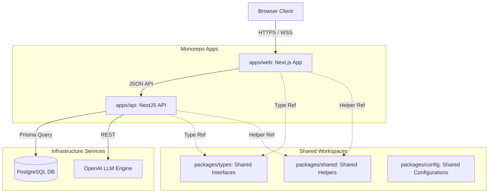

# AI Career Agent

AI Career Agent is a production-grade, engineering-focused Career Operating System. It is designed to consolidate job discovery, resume tailoring, and application tracking into a unified, high-performance monorepo workspace.

---

[](https://nextjs.org/)
[](https://react.dev/)
[](https://www.typescriptlang.org/)
[](https://tailwindcss.com/)
[](https://nodejs.org/)
[](https://www.postgresql.org/)
[](https://www.prisma.io/)
[](https://zustand-demo.pmnd.rs/)
[](https://openai.com/)

---

## 1. Project Overview

Finding a job in the modern tech ecosystem is an asymmetric struggle. Job seekers face ghost listings, automated applicant tracking system (ATS) filters, and the cognitive overhead of manually adapting resumes for every application. 

AI Career Agent is a full-featured Career Operating System built specifically for software engineers, product designers, and tech professionals. By consolidating job boards, resume editors, cover letter generators, and application trackers into a single monorepo workspace, it eliminates tool fragmentation. The platform leverages localized vector matching to filter out low-trust listings and helps candidates submit optimized applications.

---

## 2. Core Features

### Authentication & Profile Management
- **Authentication**: Secure registration, login, and session-guarded route protection.
- **Candidate Profile**: Unified dashboard tracking contact details, experience logs, education, certifications, and languages.

### Resume & Cover Letter Intelligence
- **Resume Management**: A comprehensive resume builder supporting version control, undo/redo states, and typography templates.
- **Resume Parsing**: Automated extraction of structured work history, skills, and contact schemas from uploaded PDF resumes.
- **Resume Optimization**: Advanced ATS optimization studio providing keyword gaps analysis and bullet-point rewrite suggestions.
- **Cover Letter Generator**: Dynamic cover letter engine that writes tailored, tone-adjusted pitches matching target job descriptions.

### Job Discovery & Application Tracking
- **Job Discovery**: Localized matching score evaluating candidate suitability based on skill vectors.
- **Applications Tracker**: A visual Kanban board and calendar to manage application status (Saved, Applied, Interviewing, Offered, Rejected) and schedule interviews.

### Core System Features
- **Global Search**: An accessible, keyboard-friendly command palette (`⌘+K` / `Ctrl+K`) that searches job histories and caches recent searches.
- **Dashboard**: Home feed featuring a getting-started setup checklist, metric charts, and application analytics.
- **Settings**: Interactive settings panel to toggle theme styling, manage onboarding states, and reset helper tips.
- **Notifications**: Central notification system tracking application status updates and interview alerts.
- **Responsive Layout**: Fluid brutalist layout adjustments optimized for mobile, tablet, and desktop displays.

---

## 3. Live Demo & Resources

- **Production URL**: *Deployment setup in progress*
- **Source Code**: [GitHub Repository](https://github.com/anshul4117/ai-career-agent)
- **Technical Documentation**: [Docs Directory](docs/)
- **Author Portfolio**: [Anshul's Portfolio](https://anshul4117-portfolio.vercel.app/)

---

## 4. Technology Stack

- **Frontend (Next.js 15)**: Chosen for Server Components, optimal route splitting, static pre-rendering, and seamless layout scoping.
- **Backend (NestJS)**: Selected for its strict dependency injection, modular organization, and clear controller-service boundaries suitable for scaling the API.
- **Database (PostgreSQL)**: A robust relational database selected for data integrity, ACID compliance, and structured queries.
- **ORM (Prisma ORM)**: Selected for type-safe query generation, database schema migrations, and seamless database schema synchronization with the monorepo.
- **State Management (Zustand)**: Selected for lightweight client state, persisted storage middleware, action-driven triggers, and minimal rendering overhead.
- **Authentication (AuthGuard)**: Custom middleware chosen for secure client-side cookie/token verification and route shielding.
- **AI Engine (OpenAI API)**: Leveraged for structured LLM parsing (PDF resumes to json schemas) and GPT-powered profile bullet/cover letter generation.
- **Styling (Vanilla CSS)**: Used with custom design variables to implement a premium, high-performance Brutalist Design System with minimal bundle weight.
- **Animations (Framer Motion)**: Selected for GPU-accelerated micro-animations, orbital transforms, and layout transitions.
- **Deployment (Docker & Compose)**: Containerization of database and API environments for consistent staging/production runs.
- **Developer Experience**: TS, ESLint, Prettier, Madge, and Depcheck combined to enforce compile-time safety, lint correctness, circular import detection, and unused package pruning.

---

## 5. Architecture Overview



### Monorepo Structure & Separation
This project leverages an npm-workspaces monorepo structure. This architecture provides several key advantages:
1. **Shared Type Schema**: Contract interfaces in `packages/types` compile directly for both frontend forms and backend validation controllers, preventing schema misalignment.
2. **Unified Configuration**: ESLint rules, TypeScript compile configs, and formatting directives are shared, ensuring style consistency across the entire codebase.
3. **Workspace Isolation**: Dependencies for the web client and API backend are decoupled in separate folders to prevent dependency bloating.

---

## 6. Directory Structure

```
ai-career-agent/
├── apps/
│   ├── web/                     # Next.js 15 Web Application
│   │   ├── public/              # Static public assets, PWA manifests
│   │   ├── src/                 # Next.js Source directory
│   │   │   ├── app/             # Next.js App Router (Layouts and Pages)
│   │   │   ├── components/      # Global shared UI elements (Buttons, Cards)
│   │   │   ├── features/        # Feature modules (Auth, Jobs, Resume, Onboarding)
│   │   │   └── providers/       # Providers context wrappers (Theme, Auth)
│   └── api/                     # NestJS API Backend (Modular architecture)
├── packages/
│   ├── shared/                  # Common JavaScript/TypeScript helpers
│   ├── types/                   # Unified model interfaces and schemas
│   └── config/                  # Shared tooling configurations (ESLint, TS)
├── docs/                        # Complete technical and design specs
├── infra/                       # Infrastructure orchestration configs (Docker)
```

---

## 7. Getting Started

### Prerequisites
- Node.js >= 20.0.0
- npm >= 10.0.0
- Docker & Docker Compose (for local database services)

### Installation
1. Clone the repository:
   ```bash
   git clone https://github.com/anshul4117/ai-career-agent.git
   cd ai-career-agent
   ```
2. Install dependencies:
   ```bash
   npm install
   ```

### Database Orchestration
1. Spin up the local PostgreSQL database using Docker:
   ```bash
   docker compose -f infra/docker/docker-compose.yml up -d
   ```
2. Generate the Prisma schema mapping:
   ```bash
   npx prisma generate
   ```

### Running the Application
- **Development Server**: Starts the Next.js web application dev server locally:
  ```bash
  npm run dev
  ```
- **Production Build**: Compiles an optimized, static, and code-split production build:
  ```bash
  npm run build
  ```
- **Code Linter**: Inspects workspaces for formatting and quality violations:
  ```bash
  npm run lint
  ```
- **Type Check**: Verifies type safety across all TypeScript modules:
  ```bash
  npm run type-check
  ```

---

## 8. Environment Variables

The web client expects the following local environment keys:

| Variable Key | Expected Content | Required / Optional | Target Purpose |
| :--- | :--- | :--- | :--- |
| `NEXT_PUBLIC_API_URL` | `http://localhost:4000/api` | Required | Target backend API location. |
| `NEXT_PUBLIC_APP_URL` | `http://localhost:3000` | Required | Host origin location (fallback redirects). |
| `NEXT_PUBLIC_CLERK_PUBLISHABLE_KEY` | `pk_test_...` | Optional | Client token authentication key. |
| `CLERK_SECRET_KEY` | `sk_test_...` | Optional | Secure authentication middleware verification. |

---

## 9. Documentation Index

Refer to the primary technical guidelines and specifications in the `/docs` directory:

- **Product & Scope**:
  - [Product Requirements Document (PRD)](docs/prd.md): Core platform requirements, user personas, and target scopes.
  - [Feature Release Roadmap](docs/roadmap.md): Delivery timelines and milestone configurations.
- **Technical & Architecture**:
  - [Monorepo Architecture Blueprints](docs/architecture.md): High-level system design and monorepo configurations.
  - [Database Schema & Data Model Specification](docs/database.md): Entity-relationship definitions and indexes.
  - [API Endpoint Contracts Specification](docs/api-spec.md): API routing structures and JSON payload schemas.
  - [Monorepo Code Splitting & Bundle Size Optimization Guide](docs/architecture/bundle-optimization.md): Technical report detailing `next/dynamic` splitting results.
  - [Security Vectors & HTTP Headers Policy](docs/architecture/security-report.md): Security analysis mapping anti-clickjacking and XSS configurations.
  - [SEO Indexes & PWA Mobile Integration Guide](docs/architecture/seo-pwa.md): PWA mobile compatibility and sitemap generation details.
  - [Dependency Health Audit & Lock Resolutions](docs/architecture/dependency-health.md): Vulnerability scans, circular imports, and unused dependency pruning.
- **Style & Design**:
  - [Brutalist Design Tokens System](docs/design-system.md): Brutalist CSS variable tokens, color palettes, and borders.
  - [Branding Assets & Logo Guidelines](docs/branding.md): Official assets mapping and branding configurations.
  - [Frontend Route & Pages Mapping](docs/frontend-pages.md): Route layouts and page component configurations.
- **Developer Guidelines**:
  - [Coding Standards & TypeScript Quality Rules](docs/coding-standards.md): Code formatting, type rules, and import patterns.
  - [Active Project Tasks Checklist](docs/tasks.md): Complete task history tracking implementation progress.
  - [Release Changelog History](CHANGELOG.md): Complete chronological record of platform releases.
  - [Walkthrough of Completed Work](walkthrough.md): Technical review of features implemented across all phases.

---

## 10. Engineering Highlights

- **Responsive Design**: Brutalist layouts optimized for mobile and desktop screens.
- **Dark Mode**: Dynamic CSS theme swapping utilizing `prefers-color-scheme` variables.
- **Skeleton Loading**: Custom skeleton components preventing layout shift during page load transitions.
- **Error Boundaries**: Next.js route (`app/error.tsx`) and root (`app/global-error.tsx`) boundaries with diagnostics.
- **Toast System**: Custom, lightweight event banners with Framer Motion transitions.
- **Accessibility**: Focus trapping, keyboard navigation, descriptive ARIA tags, and WCAG AA contrast.
- **SEO Ready**: Dynamic sitemaps, robots.txt crawl directives, and canonical tags.
- **PWA Ready**: Web app manifests (`site.webmanifest`) and mobile viewport color integration.

---

## 11. Performance Optimizations

- **Dynamic Imports**: Defers loading of heavy client components (`CommandPalette`, `ResumeBuilderLayout`, `CalendarView`, `ApplicationDetailDialog`) until requested.
- **Lazy Loading**: Route-level Next.js splitting preventing initial page payload bloat.
- **Code Splitting**: Dynamic Next.js chunk boundaries separating heavy dependencies.
- **Memoization**: Prevents list re-renders via `React.memo` (e.g. `SavedJobCard`).
- **Optimized Zustand Stores**: Uses isolated state selectors to prevent unnecessary hook triggering.
- **Image Optimization**: Custom `next/image` implementations using explicit sizes to prevent CLS.

---

## 12. Security Practices

- **Anti-Clickjacking**: Implemented `X-Frame-Options: DENY` via Next.js response headers.
- **Reverse Tabnabbing Shields**: Explicitly appended `rel="noopener noreferrer"` parameters to all external links.
- **Zero Raw HTML Injection**: Evaluated DOM parsing models to block XSS strings.
- **Input Validation**: Schema-level validation (Zod) on all client form fields.
- **Secure Routing**: Scoped layouts preventing public pages from mounting authentication-dependent elements.

---

## 13. Project Roadmap

### Completed
- **Phase 16**: Brutalist Error Boundaries, Offline notifier, and recovery paths.
- **Phase 17**: Persisted first-time onboarding tours, setup checklists, and help panels.
- **Phase 18**: Premium animated loaders orbiting upright icons.
- **Phase 19**: Code-split dynamic bundles and size optimizations.
- **Phase 20**: Security headers and dependency health audits.
- **Phase 21**: PWA mobile viewports, alternates, robots, and sitemap indexes.
- **Phase 22**: Complete rewrite of technical documentation and developer guides.

### Currently In Progress
- **Phase 23**: Professional README Overhaul and open-source alignment.

### Future Enhancements
- **Phase 24**: Core Postgres relational schema migrations and NestJS route controllers.

---

## 14. Contributing

Contributions are welcome! Please follow these guidelines:
1. Form a clear feature branch: `git checkout -b feature/your-feature-name`.
2. Ensure your changes compile cleanly without type checks or linting errors: `npm run type-check && npm run lint`.
3. Submit a pull request detailing the changes made and link the relevant task issue.
4. Keep commit messages clear (e.g., `feat(jobs): add recent searches caching` or `fix(auth): update redirection paths`).

---

## 15. License

This project is licensed under the MIT License - see the [LICENSE](LICENSE) file for details.

---

## 16. Author

- **Anshul**
- **GitHub**: [@anshul4117](https://github.com/anshul4117)
- **LinkedIn**: [Anshul's Profile](https://www.linkedin.com/in/anshul-ab7135245/)
- **Portfolio**: [Anshul's Portfolio](https://anshul4117-portfolio.vercel.app/)
