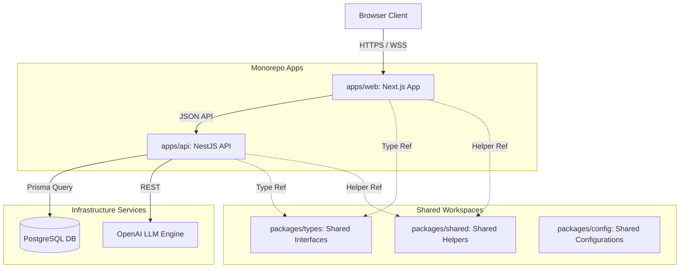

# AI Career Agent

AI Career Agent is a production-grade, engineering-focused Career Operating System. It is designed to empower tech professionals to discover verified job opportunities, optimize their resumes and profiles, and manage their application lifecycle within a unified, high-performance workspace.

---

[](https://nextjs.org/)
[](https://react.dev/)
[](https://www.typescriptlang.org/)
[](https://tailwindcss.com/)
[](https://nodejs.org/)
[](https://www.postgresql.org/)
[](https://www.prisma.io/)
[](https://zustand-demo.pmnd.rs/)
[](https://openai.com/)

---

## 1. Project Overview

Finding a job in the modern tech ecosystem is an asymmetric struggle. Job seekers face ghost listings, automated applicant tracking system (ATS) filters, and the cognitive overhead of manually adapting resumes for every application. 

**AI Career Agent** is a full-featured Career Operating System built specifically for software engineers, product designers, and tech professionals. By consolidating job boards, resume editors, cover letter generators, and application trackers into a single monorepo workspace, it eliminates tool fragmentation. The platform leverages localized vector matching to filter out low-trust listings and helps candidates submit optimized applications.

---

## 2. Feature Overview

- **Authentication**: Secure registration, login, and session-guarded route protection.
- **Candidate Profile**: A unified dashboard tracking contact info, experience logs, education, certifications, and languages.
- **Resume Management**: A comprehensive resume builder supporting real-time preview, version control, undo/redo states, and dynamic typography templates.
- **Resume Parsing**: Seamless extraction of structured work history, skills, and contact schemas from uploaded PDF resumes.
- **AI Job Matching**: Localized scoring system that evaluates candidates' suitability for verified, fresh job listings based on skill vectors.
- **Resume Optimization**: Advanced ATS optimization studio providing keyword gaps analysis and bullet-point rewrite suggestions.
- **Cover Letter Generator**: Dynamic cover letter engine that writes tailored, tone-adjusted pitches matching the target job description.
- **Applications Tracker**: A visual Kanban board and calendar to manage application status (Saved, Applied, Interviewing, Offered, Rejected) and schedule interviews.
- **Global Search**: An accessible, keyboard-friendly command palette (`⌘+K` / `Ctrl+K`) that searches job histories and caches recent searches.
- **Dashboard**: A comprehensive home feed featuring a getting-started setup checklist, metric charts, and application analytics.
- **Settings**: Interactive settings panel to toggle theme styling, manage onboarding states, and reset helper tips.
- **Notifications**: Central notification system tracking application status updates and interview alerts.
- **AI Features**: Interactive evaluation loops, automated skills matching, and LLM-assisted copywriting.
- **Responsive Design**: Fluid brutalist layout adjustments optimized for mobile, tablet, and widescreen displays.

---

## 3. Live Demo & Resources

- **Production URL**: *(Staging / deployment setup in progress)*
- **Source Code**: [GitHub Repository](https://github.com/anshul4117/ai-career-agent)
- **Technical Documentation**: [Docs Directory](docs/)
- **Author Portfolio**: [Anshul's Portfolio](https://anshul4117-portfolio.vercel.app/)

---

## 4. Tech Stack

- **Frontend**: Next.js 15 (App Router) + React 19 + TypeScript
- **Backend**: NestJS (Modular API architecture, Dependency Injection)
- **Database**: PostgreSQL
- **ORM**: Prisma ORM
- **State Management**: Zustand (Persisted stores, undo/redo history middleware)
- **Authentication**: Guarded Session middleware (AuthGuard hooks)
- **AI Engine**: OpenAI API (GPT models for parser extraction and adaptation writing)
- **Styling**: Vanilla CSS (Brutalist Design System tokens, dynamic theme root variables)
- **Animation**: Framer Motion (Orbits, staggered lists, slide sheets)
- **Deployment**: Docker + Docker Compose + Vercel
- **Developer Tools**: ESLint + TypeScript + Prettier + Madge + Depcheck

---

## 5. Architecture



### Why This Architecture Was Chosen
This project leverages an npm-workspaces monorepo structure. This architecture provides several key advantages:
1. **Shared Type Schema**: Contract interfaces in `packages/types` compile directly for both frontend forms and backend validation controllers, preventing schema misalignment.
2. **Unified Configuration**: ESLint rules, TypeScript compile configs, and formatting directives are shared, ensuring style consistency across the entire codebase.
3. **Workspace Isolation**: Dependencies for the web client and API backend are decoupled in separate folders to prevent dependency bloating.

---

## 6. Folder Structure

```
ai-career-agent/
├── apps/
│   ├── web/                     # Next.js 15 Web Application
│   │   ├── public/              # Static public assets, PWA manifests
│   │   ├── src/                 # Next.js Source directory
│   │   │   ├── app/             # Next.js App Router (Layouts and Pages)
│   │   │   ├── components/      # Global shared UI elements (Buttons, Cards)
│   │   │   ├── config/          # Site config constants
│   │   │   ├── features/        # Feature modules (Auth, Jobs, Resume, Onboarding)
│   │   │   ├── hooks/           # Reusable React hooks
│   │   │   ├── lib/             # Custom utility functions (cn)
│   │   │   ├── providers/       # Providers context wrappers (Theme, Auth)
│   │   │   ├── services/        # Fetch API adapters
│   │   │   └── store/           # Global Zustand store definitions
│   └── api/                     # NestJS API Backend (Modular architecture)
├── packages/
│   ├── shared/                  # Common JavaScript/TypeScript helpers
│   ├── types/                   # Unified model interfaces and schemas
│   └── config/                  # Shared tooling configurations (ESLint, TS)
├── docs/                        # Complete technical and design specs
├── infra/                       # Infrastructure orchestration configs (Docker)
```

---

## 7. Installation & Setup

### 1. Clone the repository
```bash
git clone https://github.com/anshul4117/ai-career-agent.git
cd ai-career-agent
```

### 2. Install dependencies
Install workspaces dependencies from the root directory:
```bash
npm install
```

### 3. Environment Setup
Create a `.env.local` file inside the web application directory:
```bash
cp apps/web/.env.local.example apps/web/.env.local
```
Add your respective API URLs, authentication keys, and service secrets inside `apps/web/.env.local`.

### 4. Database Orchestration
Spin up the local PostgreSQL database using Docker Compose:
```bash
docker compose -f infra/docker/docker-compose.yml up -d
```
Generate the Prisma schema mapping:
```bash
npx prisma generate
```

### 5. Running the Application
To run the Next.js web application dev server locally:
```bash
npm run dev
```

---

## 8. Environment Variables

The web client expects the following local environment keys:

| Variable Key | Expected Content | Required / Optional | Target Purpose |
| :--- | :--- | :--- | :--- |
| `NEXT_PUBLIC_API_URL` | `http://localhost:4000/api` | Required | Target backend API location. |
| `NEXT_PUBLIC_APP_URL` | `http://localhost:3000` | Required | Host origin location (fallback redirects). |
| `NEXT_PUBLIC_CLERK_PUBLISHABLE_KEY` | `pk_test_...` | Optional | Client token authentication key. |
| `CLERK_SECRET_KEY` | `sk_test_...` | Optional | Secure authentication middleware verification. |

---

## 9. Available Scripts

The following workspaces scripts can be executed from the root monorepo directory:

- **`npm run dev`**: Starts the Next.js web application dev server locally.
- **`npm run build`**: Compiles an optimized, static, and code-split production build.
- **`npm run lint`**: Inspects all workspaces for stylistic and quality violations.
- **`npm run type-check`**: Invokes the TypeScript compiler (`tsc`) to verify type safety.

---

## 10. Documentation

Refer to the primary technical guidelines and specifications in the `/docs` directory:

- **Product & Scope**:
  - [Product Requirements Document (PRD)](docs/prd.md)
  - [Feature Release Roadmap](docs/roadmap.md)
- **Technical & Architecture**:
  - [Monorepo Architecture Blueprints](docs/architecture.md)
  - [Database Schema & Data Model Specification](docs/database.md)
  - [API Endpoint Contracts Specification](docs/api-spec.md)
  - [Monorepo Code Splitting & Bundle Size Optimization Guide](docs/architecture/bundle-optimization.md)
  - [Security Vectors & HTTP Headers Policy](docs/architecture/security-report.md)
  - [SEO Indexes & PWA Mobile Integration Guide](docs/architecture/seo-pwa.md)
  - [Dependency Health Audit & Lock Resolutions](docs/architecture/dependency-health.md)
- **Style & Branding**:
  - [Brutalist Design Tokens System](docs/design-system.md)
  - [Branding Assets & Logo Guidelines](docs/branding.md)
  - [Frontend Route & Pages Mapping](docs/frontend-pages.md)
- **Developer Guidelines**:
  - [Coding Standards & TypeScript Quality Rules](docs/coding-standards.md)
  - [Active Project Tasks Checklist](docs/tasks.md)
  - [Release Changelog History](CHANGELOG.md)
  - [Walkthrough of Completed Work](walkthrough.md)

---

## 11. Production Features

- **Dark Mode**: Dynamic visual theme switcher utilizing CSS variables and media query listeners.
- **Error Boundaries**: Client-side boundaries (`app/error.tsx`) to catch component failures and fatal layout crashes (`app/global-error.tsx`).
- **Skeleton Loading**: Reusable loaders (`ResumeBuilderSkeleton`, `CalendarSkeleton`) to prevent content jumps.
- **Toast System**: Custom, animated, and accessible inline banners supporting multiple notification types.
- **Accessibility (a11y)**: Focus trapping, keyboard navigation, descriptive ARIA tags, and color contrast ratios exceeding WCAG AA.
- **Performance Optimization**: Dynamic client-side lazy loading (`next/dynamic`) and route splitting.
- **Security & Headers**: Next.js HTTP security headers (Clickjacking shields, MIME-sniffing protection).
- **SEO & PWA Ready**: Dynamic sitemap and robots XML mapping, viewport support, and standalone web manifests.

---

## 12. Performance & Optimizations

- **Dynamic Imports**: Defers loading of heavy UI elements (e.g. `CommandPalette`, `ResumeBuilderLayout`, `CalendarView`) until requested.
- **React.memo**: Memoized card items (e.g. `SavedJobCard`) to prevent unnecessary list re-renders.
- **Zustand Optimization**: Isolated state selectors to minimize hook trigger frequencies.
- **Code Splitting**: Route-level Next.js code splitting to minimize initial JS payload.

---

## 13. Security Practices

- **Anti-Clickjacking**: Implemented `X-Frame-Options: DENY` via Next.js response headers.
- **Reverse Tabnabbing Shields**: Explicitly appended `rel="noopener noreferrer"` parameters to all external links.
- **Zero Raw HTML Injection**: Evaluated DOM parsing models to block XSS strings.
- **Input Validation**: Schema-level validation (Zod) on all client form fields.

---

## 14. Project Roadmap

- [x] **Phase 16**: Brutalist Error Boundaries, Offline notifier, and recovery paths.
- [x] **Phase 17**: Persisted first-time onboarding tours, setup checklists, and help panels.
- [x] **Phase 18**: Premium animated loaders orbiting upright icons.
- [x] **Phase 19**: Code-split dynamic bundles and size optimizations.
- [x] **Phase 20**: Security headers and dependency health audits.
- [x] **Phase 21**: PWA mobile viewports, alternates, robots, and sitemap indexes.
- [x] **Phase 22**: Complete rewrite of technical documentation and developer guides.
- [/] **Phase 23**: Professional README Overhaul and open-source alignment.

---

## 15. Contributing

Contributions are welcome! Please follow these guidelines:
1. Form a clear feature branch: `git checkout -b feature/your-feature-name`.
2. Ensure your changes compile cleanly without type checks or linting errors: `npm run type-check && npm run lint`.
3. Submit a pull request detailing the changes made and link the relevant task issue.

---

## 16. License

This project is licensed under the MIT License - see the [LICENSE](LICENSE) file for details.

---

## 17. Author

- **Anshul**
- **GitHub**: [@anshul4117](https://github.com/anshul4117)
- **LinkedIn**: [Anshul's Profile](https://www.linkedin.com/in/anshul-ab7135245/)
- **Portfolio**: [Anshul's Portfolio](https://anshul4117-portfolio.vercel.app/)
