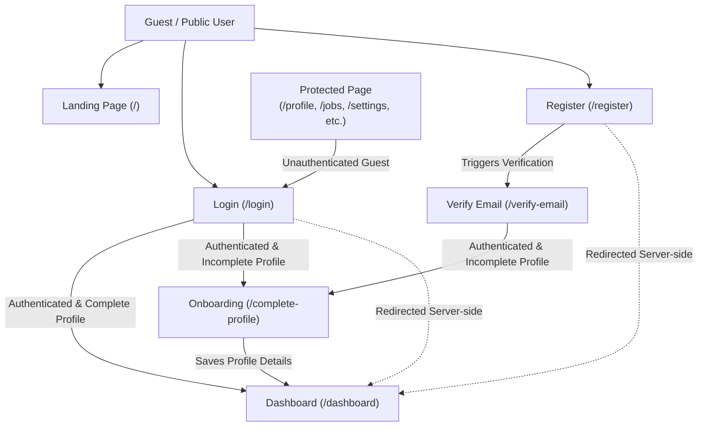
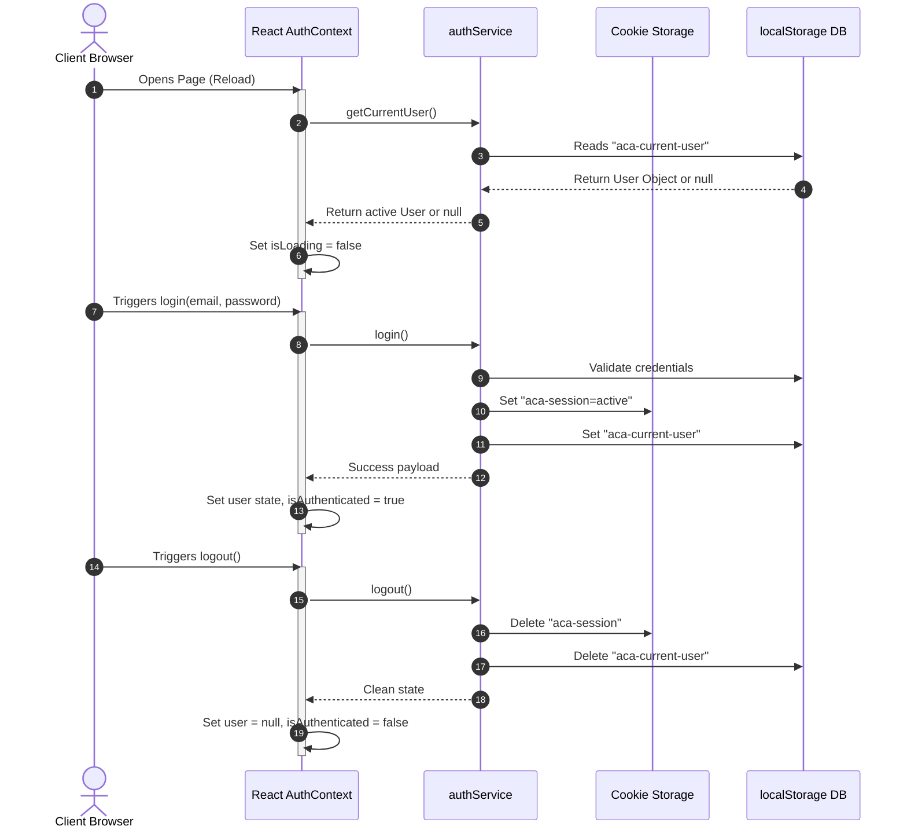

# Master Application Flow & Route Architecture Specification

This document serves as the **Single Source of Truth** for routing classification, user workflows, redirect policies, session lifecycles, and middleware enforcement rules for the AI Career Agent application.

---

## 1. Route Architecture Diagram

Below is the user flow diagram illustrating the transitions between guest status, authentication, onboarding, and dashboard access.



---

## 2. Route Grouping Table

All application routes are categorized into distinct security groups. Each group dictates how the system responds depending on whether a session cookie (`aca-session`) is present.

| Path | Group | Authenticated Session Behavior | Guest (No Session) Behavior |
| :--- | :--- | :--- | :--- |
| `/` | Public | Allowed (or redirect to `/dashboard` if toggled) | Allowed (Renders Landing) |
| `/about`, `/pricing` | Public | Allowed | Allowed |
| `/login` | Guest-only (Auth) | **Redirect to `/dashboard`** | Allowed (Renders login form) |
| `/register` | Guest-only (Auth) | **Redirect to `/dashboard`** | Allowed (Renders signup form) |
| `/forgot-password` | Guest-only (Auth) | **Redirect to `/dashboard`** | Allowed |
| `/reset-password` | Guest-only (Auth) | **Redirect to `/dashboard`** | Allowed |
| `/verify-email` | Guest-only (Auth) | **Redirect to `/dashboard`** | Allowed (Code submission) |
| `/dashboard` | Protected | Allowed (Renders main app) | **Redirect to `/login`** |
| `/complete-profile` | Onboarding | Allowed | **Redirect to `/login`** |
| `/profile` | Protected | Allowed | **Redirect to `/login`** |
| `/resume` | Protected | Allowed | **Redirect to `/login`** |
| `/jobs` | Protected | Allowed | **Redirect to `/login`** |
| `/saved-jobs` | Protected | Allowed | **Redirect to `/login`** |
| `/applications` | Protected | Allowed | **Redirect to `/login`** |
| `/cover-letters` | Protected | Allowed | **Redirect to `/login`** |
| `/settings` | Protected | Allowed | **Redirect to `/login`** |

---

## 3. Middleware Logic Explanation (Primary Enforcement)

Next.js Middleware serves as the **primary server-side enforcement layer**. It intercepts every HTTP request before Next.js routing triggers and performs validation at the Edge runtime:

1. **Extract Cookie**: Evaluates `req.cookies.get("aca-session")`.
2. **Classify Path**: Checks if the target path is in `protectedRoutes` or `guestRoutes`.
3. **Enforce Guest Guard**:
   - If `isAuthenticated === true` and the user tries to access `/login`, `/register`, etc., the middleware returns `NextResponse.redirect("/dashboard")`.
4. **Enforce Auth Guard**:
   - If `isAuthenticated === false` and the user tries to access `/dashboard`, `/profile`, `/settings`, etc., the middleware returns `NextResponse.redirect("/login")`.
5. **Neutral Check**:
   - For all other matched assets and public landing pages, it continues using `NextResponse.next()`.

---

## 4. Guard Implementation Strategy (Client-side Safety)

To prevent UI flickering (flashing auth forms or layouts for 1 frame before redirecting), we employ a secondary client-side safety guard in React:

```typescript
// GuestGuard Component Wrapper
export function GuestGuard({ children }: { children: React.ReactNode }) {
  const { isAuthenticated, isLoading } = useAuth();
  const router = useRouter();

  useEffect(() => {
    if (!isLoading && isAuthenticated) {
      router.replace("/dashboard");
    }
  }, [isAuthenticated, isLoading, router]);

  if (isLoading || isAuthenticated) {
    return <AuthLoadingSkeleton />; // Shows full-page skeleton, preventing form layout flash
  }

  return <>{children}</>;
}

// AuthGuard Component Wrapper
export function AuthGuard({ children }: { children: React.ReactNode }) {
  const { isAuthenticated, isLoading, user } = useAuth();
  const router = useRouter();

  useEffect(() => {
    if (!isLoading) {
      if (!isAuthenticated) {
        router.replace("/login");
      } else if (user && !user.profileCompleted) {
        router.replace("/complete-profile");
      }
    }
  }, [isAuthenticated, isLoading, user, router]);

  if (isLoading || !isAuthenticated || (user && !user.profileCompleted)) {
    return <DashboardLoadingSkeleton />;
  }

  return <>{children}</>;
}
```

---

## 5. Session Lifecycle Diagram

The diagram below details the lifespans, storage synchronization, and trigger points of active user sessions.



---

## 6. Edge Case Handling List

| Edge Case | Description | Mitigation Strategy |
| :--- | :--- | :--- |
| **Already Signed In Error** | User attempts to submit login form while their session is already restored. | The login button is disabled while `isLoading` is true, and `GuestGuard` redirects them to `/dashboard` before they can interact with the page. |
| **Session Expiration** | Session token becomes invalid while browsing. | Any network layer response returning a 401 triggers `authService.logout()`, automatically deleting local storage, cookies, and forcing a redirect to `/login`. |
| **Refresh During Authentication** | Page is reloaded while login request is in-flight. | Transient state is lost but `localStorage` remains untouched. Upon reload, `AuthProvider` initializes with `isLoading = true`, preventing UI rendering until state resolves. |
| **Race Conditions** | Client React mount vs Next.js Edge Middleware redirect. | Next.js middleware acts as the source of truth on the network edge. Unauthenticated requests are redirected before the HTML reaches the browser, eliminating client-side races. |
| **Double Form Submissions** | User clicks submit button multiple times. | UI buttons receive `disabled={isLoading}` state during execution to prevent duplicate requests. |

---

## 7. Recommended Folder Structure

Below is the directory design enforcing routing guards and auth components layout:

```
apps/web/src/
├── app/
│   ├── (auth)/
│   │   ├── layout.tsx            <-- Wraps with GuestGuard
│   │   ├── login/
│   │   ├── register/
│   │   ├── forgot-password/
│   │   └── reset-password/
│   │
│   ├── (dashboard)/
│   │   ├── layout.tsx            <-- Wraps with AuthGuard
│   │   ├── dashboard/
│   │   ├── profile/
│   │   └── settings/
│   │
│   └── middleware.ts             <-- Core server-side Edge redirect guard
│
├── features/
│   └── auth/
│       ├── components/           <-- Isolated UI forms
│       ├── hooks/
│       │   └── use-auth.ts       <-- Interface hook
│       ├── providers/
│       │   └── auth-provider.tsx <-- React Context Provider
│       └── services/
│           └── auth.service.ts   <-- Session & Local DB Service
```
