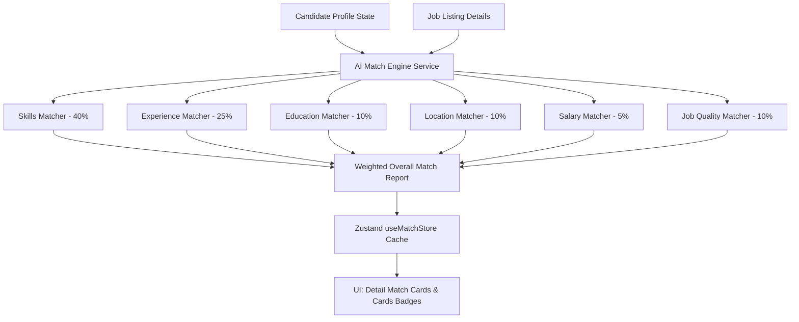

# Job Discovery: AI Match Engine Architecture
 
## 1. Overview
The **AI Match Engine** evaluates the compatibility between a candidate's profile (skills, education, location, experience, and target preferences) and a specific job posting. It generates a personalized match percentage, identifies skill gaps, and recommends upskilling roadmap items.
 

 
---
 
## 2. Match Algorithms & Parameters
 
### A. Skills Overlap (Weight: 40%)
Compares candidate's skills list against required skills in the job specification:
- **Calculation**: Computes overlap using substring and lowercase exact-match checks.
- **Formula**:
  $$\text{Skills Score} = \frac{\text{Count}(\text{Matched Skills})}{\text{Count}(\text{Required Skills})} \times 100$$
- **Outputs**:
  - `Matched Skills`: skills configured in the profile that overlap.
  - `Missing Skills`: skills required by the job but missing in the profile.
  - `Additional Skills`: other candidate profile skills not specified in the required listing.

### B. Experience Level Alignment (Weight: 25%)
Maps candidate years of experience against job seniority expectations:
- **Senority mapping**:
  - Entry Level: 0+ years
  - Mid Level: 2+ years
  - Senior Level: 5+ years
  - Lead / Principal: 9+ years
- **Decay penalty**:
  - Meeting/Exceeding minimum: 100% Score
  - 1 year short: 80% Score
  - 2 years short: 60% Score
  - >2 years short: 30% Score

### C. Educational Alignment (Weight: 10%)
Scans job descriptions for credentials indicators (e.g. Master's, PhD, MTech) and cross-references listed profile degrees:
- **Role prefers Master's but candidate has Bachelor's**: 70% Score
- **Credential aligns or no specific master's required**: 100% Score
- **No educational credentials in profile**: 50% Score

### D. Location Preferences (Weight: 10%)
Compares candidate's target location and preferred mode against job details:
- **Job is remote**: 100% Score
- **Job is onsite/hybrid in preferred city**: 100% Score
- **Job is onsite/hybrid in another city**: 50% Score
- **No preferences set (matches location city)**: 80% Score

### E. Salary Targets (Weight: 5%)
Checks candidate's expected compensation against job limits:
- **Expected salary <= Job max budget**: 100% Score
- **Expected salary > Job max budget**: 60% Score
- **Job salary undisclosed**: 80% Score
- **No target expected salary configured**: 90% Score

### F. Job Quality Index (Weight: 10%)
Reflects the verified rating score computed by the Job Quality Engine ($40\%$ Freshness + $60\%$ Trust).

---
 
## 3. Fit Analytics & Upskilling Roadmap
 
### A. Why This Job? Explanations
Generates human-readable highlights:
- **Core Skills**: Returns positive signals for matched skillsets or lists key missing parameters.
- **Experience Duration**: Validates if candidate experience spans the required duration.
- **Geography & Mode**: Evaluates match of onsite/hybrid and remote options.
- **Salary Check**: Verifies if expected salary boundaries fit the listing budget.

### B. Upskilling Recommendations Logic
When missing skills are identified, the engine dynamically drafts action items:
- **React**: "Build a sample project in React and learn Hooks"
- **Node**: "Learn Node.js event loops and create Express/Nest services"
- **Docker**: "Learn Docker containerization and image tagging"
- **AWS**: "Take AWS Cloud Practitioner or Solutions Architect training"
- **Kubernetes**: "Study Kubernetes pods, deployments, and cluster management"
- **Redis**: "Study Redis caching, rate limiters, and data structures"
- **System Design**: "Practice system design fundamentals (scaling, load balancers)"
 
---
 
## 4. Zustand Store Integration & UI Elements
 
The `useMatchStore` manages loading latencies and client-side caching:
- **Interactive details panel**: In `JobDetailsPane`, the match report renders in sequential order right below the Requirements card.
- **Personalized Job Badges**: Renders match score labels directly on list items in real-time.
- **Filters Integration**: The `JobsFilter` sidebar supports 1-click filters filtering results by match score tiers or skill counts.
