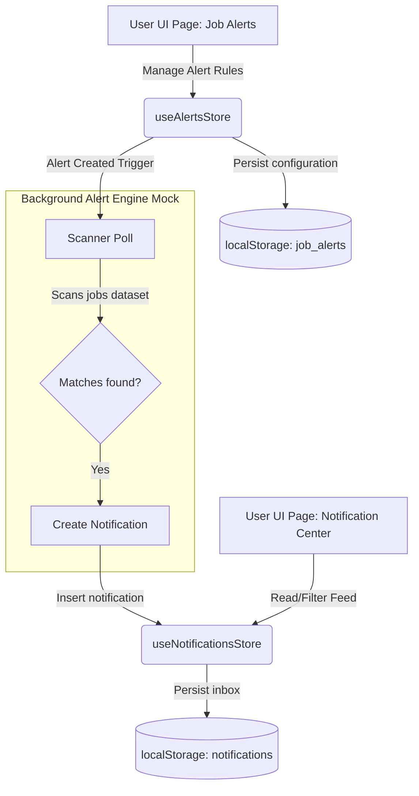

# Job Alerts & Notifications Architecture
 
## 1. Separation of Responsibilities
 
To achieve a production-grade notification workflow similar to modern professional networks (e.g., LinkedIn, Indeed), the architecture explicitly decouples **Alert Rule Configuration** from the **Notification Delivery Feed**.
 

 
### Job Alerts = Alert Management
- **Scope**: Configuration and lifecycle of automated search subscriptions.
- **Data Model**: `JobAlert` type managing filter criteria (keywords, company, salary ranges, location types) and scheduled frequency settings (Instant, Daily, Weekly).
- **Actions**: Create Alert, Edit Alert, Duplicate Alert, Delete Alert, Toggle Enable/Disable (Pause/Resume).
- **Display**: Applied filter badges, active statuses, next scheduled scan time, and last trigger time.
 
### Notifications = Notification Center
- **Scope**: User's central notification inbox aggregating events from all platform systems.
- **Data Model**: `NotificationItem` containing title, category, description, read status, and contextual navigation actions.
- **Sources**:
  - *Job Alerts*: Matches found by search subscription.
  - *Applications*: Updates to application phases (e.g. Interview request).
  - *Resume Parsing*: Extracted profiles ready for review.
  - *Resume Optimization*: Suggestions to increase ATS matches.
  - *AI Matches*: High similarity score alerts.
  - *Cover Letters*: Generated document assets.
  - *System*: Platform updates and onboarding.
- **Actions**: Mark as Read, Mark All as Read, Delete Notification, Category Filtering, Read/Unread Status Filtering, View Target Route Action.
 
---
 
## 2. Shared Architecture & Match Flow
 
When a user creates a new Job Alert, the frontend triggers a mock background engine cycle:
1. `useAlertsStore.createAlert(alertData)` is dispatched.
2. The alert is saved locally.
3. A background process (`setTimeout` simulation) runs to query the jobs database matching the new alert's filters.
4. If matches are found, it calls `useNotificationsStore.addMockNotification({ category: 'job_alerts', title: 'New Matches', ... })`.
5. The notification appears instantly inside the Notification Center feed with a **View** button leading to the pre-filtered `/jobs` page.
