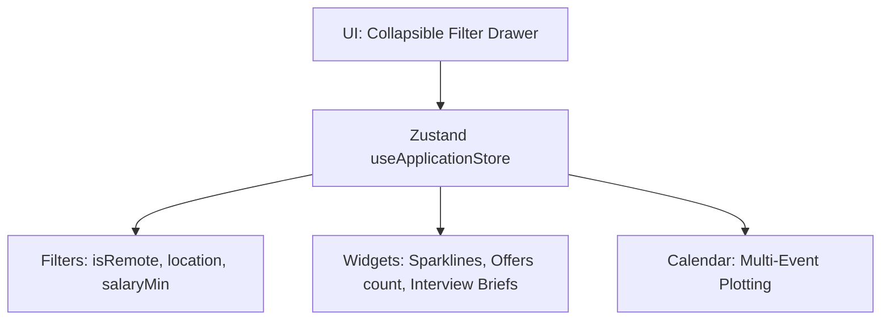

# Job Discovery: Application Tracker (Advanced) Architecture
 
## 1. Overview
The **Advanced Application Tracker** extends the core tracking module with multi-event calendars, collapsible filter panels, and high-fidelity widgets.
 

 
---
 
## 2. Extended Properties Schema
The `JobApplication` data model includes properties to track recruiters, negotiations, and deadlines:
 
*   `phone`: Recruiter direct phone number.
*   `salaryDiscussion`: Log of salary discussions and equity details.
*   `interviewerName`: Name of the interviewer.
*   `meetingLink`: Google Meet/Zoom URL.
*   `offerDeadline`: YYYY-MM-DD expiration date.
*   `isRemote`: Boolean flag.
*   `location`: City name.
*   `salaryRange`: Numeric salary string.
 
---
 
## 3. Multi-Event Calendar Mapping
`calendar-view.tsx` maps multiple events per day based on application fields:
1.  **Scheduled Interviews**: Matches `interviewDate` where status is not `ASSESSMENT`. Renders a **Video** icon (yellow tag).
2.  **Coding Assessments**: Matches `interviewDate` where status is `ASSESSMENT`. Renders a **Code** icon (purple tag).
3.  **Offer Deadlines**: Matches `offerDeadline`. Renders a **Gift** icon (emerald tag).
4.  **Follow-up Tasks**: Matches `appliedAt` (offset by 7 days) where status is `APPLIED` or `SCREENING`. Renders a **Bell** icon (blue tag).
 
---
 
## 4. Advanced Filter Flow
1.  Users click the **Filters** toggle to slide open the collapsible filter grid.
2.  Filters include **Location Mode** (All, Remote, Onsite), **Office City Location**, **Min Annual Salary ($)**, and **Company Name**.
3.  Active filters are displayed as removable tags in the active filters toolbar.
 
---
 
## 5. Dashboard Productivity Widgets
*   **Interview Briefs**: Renders upcoming scheduled rounds with meeting links, time, and interviewer name.
*   **Active Offers**: Shows open offers, offer details, and expiration date badges.
*   **Weekly Activity**: Displays a 7-day sparkline bar chart representing application activity.
*   **Recent Applications**: Checklist of recently submitted applications.
*   **Follow-up Tasks**: List of active roles that need follow-ups.
