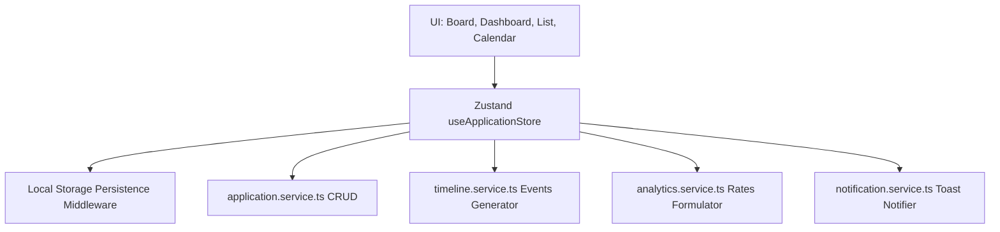

# Job Discovery: Application Tracker Architecture
 
## 1. Overview
The **Application Tracker** manages the lifecycle of job applications. It supports multi-view tabs (Kanban, List, Calendar, Dashboard) to track recruiters, notes, timelines, schedules, and conversion metrics in a responsive interface styled with the Brutalist Design System.
 

 
---
 
## 2. Status Pipeline & Lifecycle
Each application belongs to a distinct stage of the recruitment process:
 
$$\text{Saved} \rightarrow \text{Applied} \rightarrow \text{Screening} \rightarrow \text{Assessment} \rightarrow \text{Interview} \rightarrow \text{Offer} \rightarrow \text{Accepted or Rejected / Withdrawn}$$
 
*   **SAVED**: Bookmarked role.
*   **APPLIED**: Submitted application profile.
*   **SCREENING**: Under review by recruiter.
*   **ASSESSMENT**: Technical tests or homework.
*   **INTERVIEW**: Live panels.
*   **OFFER**: Formal compensation offer received.
*   **ACCEPTED**: Hired.
*   **REJECTED**: Process closed by company.
*   **WITHDRAWN**: Cancelled by user.
 
---
 
## 3. Timeline Architecture
Whenever an application status transitions:
1.  The user changes the stage on the board or in the dialog.
2.  `timelineService.createEvent()` runs, generating a customized `TimelineEvent` with:
    *   `id`: Unique string.
    *   `stage`: The target status.
    *   `title`: Event descriptor (e.g., "Interview Scheduled").
    *   `description`: Descriptive logs.
    *   `timestamp`: ISO string of the transition.
3.  The new event is appended to the application's chronological history.
 
---
 
## 4. Analytics & Charting Architecture
The tracker computes conversion rates in real-time based on non-saved applications (representing active workflows):
*   **Response Rate**: Ratio of applications that progressed past `APPLIED`.
*   **Interview Invite Rate**: Ratio of applications reaching `INTERVIEW` or later.
*   **Offer Conversion Rate**: Ratio of applications reaching `OFFER` or later.
*   **Line Graph Rendering**: Renders a monthly timeline using standard SVG coordinates:
    *   $X$-coordinates calculated dynamically: $\text{padding} + i \times \frac{\text{width} - 2\text{padding}}{\text{months} - 1}$.
    *   $Y$-coordinates mapped against the maximum applications month count: $\text{height} - \text{padding} - \text{count} \times \frac{\text{height} - 2\text{padding}}{\text{maxCount}}$.
    *   Wrapped tooltips inside `<g><title>...</title></g>` elements for screen reader readability.
 
---
 
## 5. State Management & Folder Structure
 
State is managed using a client-side Zustand store with localStorage persistence to keep user changes intact across page reloads:
 
```
src/features/applications/
├── components/
│   ├── applications-dashboard.tsx    # Stats cards & SVG charts
│   ├── kanban-board.tsx             # Columns layout & drag controls
│   ├── calendar-view.tsx            # Navigation month calendar grid
│   └── application-detail-dialog.tsx# Sidebar notes & schedules editor
├── mock/
│   └── applications.ts              # Pre-seeded applications
├── services/
│   ├── application.service.ts       # Database CRUD simulator
│   ├── timeline.service.ts          # History transition generator
│   ├── analytics.service.ts         # Math conversion calculator
│   └── notification.service.ts      # Toast alerting generator
├── store/
│   └── application.store.ts         # Zustand persist store
└── types/
    └── application.types.ts         # JobApplication & Event interfaces
```
 
---
 
## 6. Accessibility Integration
1.  **Keyboard Board Shifts**: Next to every Kanban card header, a chevron shift drawer displays when focused, allowing keyboard users to press left/right arrows to slide applications across columns without dragging.
2.  **Screen Reader SVG Support**: SVG line graphs specify `role="img"` and contain clear `aria-label` structures to explain distributions to assistive technologies.
3.  **Keyboard Navigable Tables**: Main list tables support proper `<th>` scoping and full keyboard navigation.
