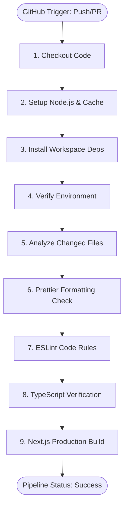
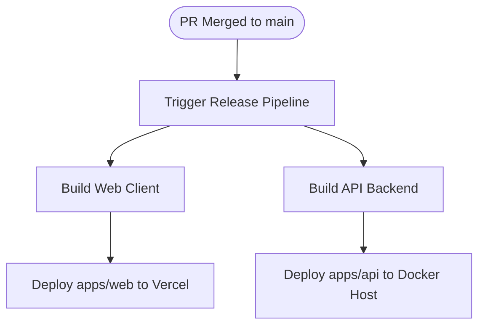

# CI/CD Pipeline Architecture

This document specifies the design, workflow steps, execution parameters, and deployment strategies of the continuous integration and delivery (CI/CD) pipelines implemented for the AI Career Agent platform.

---

## 1. Pipeline Overview

The CI pipeline is designed to safeguard the code quality of the main trunk by automatically triggering audits on every commit:
- **Triggers**: push & pull_request.
- **Branches**: `main`, `develop`.

A failure in any validation gate halts execution and blocks the pull request merge capability on GitHub.

---

## 2. Workflow Execution Steps

### Detailed Pipeline Actions

1. **Checkout Code (`actions/checkout@v4`)**:
   Fetches the git commit history. Configured with `fetch-depth: 0` to enable git diff analysis on branch changes.
2. **Setup Node.js & Cache (`actions/setup-node@v4`)**:
   Configures the target Node.js LTS environment (Node `20.x`) and hooks into dependency cache engines.
3. **Install Dependencies (`npm ci`)**:
   Runs clean package installs based on the `package-lock.json` file to guarantee reproducible clean environments.
4. **Verify Environment**:
   Validates the system environment by logging Node.js, npm, OS parameters, and workspace variables to ensure proper system initialization.
5. **Formatting Check on Changed Files (`tj-actions/changed-files@v44`)**:
   Performs formatting checks (`npx prettier --check`) **only on modified files** in the active branch. This is a production best practice that prevents legacy coding formatting styling from blocking current feature integrations.
6. **Run ESLint (`npm run lint`)**:
   Validates linting rules to enforce code formatting guidelines.
7. **Run TypeScript Compiler (`npm run type-check`)**:
   Invokes type checking (`tsc --noEmit`) to verify type safety across all workspaces.
8. **Run Production Build (`npm run build`)**:
   Compiles Next.js optimized bundles and static page traces, proving that the codebase builds cleanly without runtime issues.

---

## 3. Pipeline Caching Strategy

To optimize build speeds (reducing runtimes from 3-4 minutes down to under 1.5 minutes), we utilize npm cache keys:
- The setup action `actions/setup-node@v4` automatically resolves lockfile hashes (`package-lock.json`) to generate caching directories (`~/.npm`).
- Next.js build cache directories (`.next/cache`) are preserved across runs for production compilation stages.

---

## 4. Future Deployment Architecture

Once backend integrations are complete, the following release strategies will be executed:

1. **Frontend (Vercel)**:
   - Automated preview deployments triggered on branch pull requests.
   - Production promotion on merges to `main`.
2. **Backend API (Docker & Cloud Platforms)**:
   - NestJS API backend built as a lightweight Docker container and deployed to cloud orchestrators (e.g. AWS ECS, Render, or Fly.io).
   - PostgreSQL migrations executed dynamically using Prisma CLI hooks.
