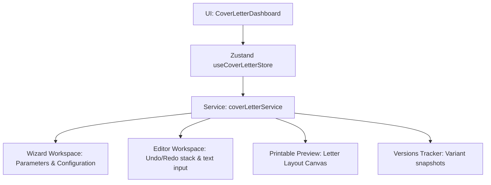

# AI Cover Letter Generator Architecture
 
## 1. Overview
The **AI Cover Letter Generator** creates tailored application letters.
 

 
---
 
## 2. Template System
We support 5 template structures:
1.  **Professional**: Formal corporate structure.
2.  **Startup Tech**: Tech-first phrasing and bold objectives.
3.  **Enterprise Systems**: Focuses on stability, guidelines, and compliance.
4.  **Streamlined Modern**: Compact block layout.
5.  **Letter Minimal**: Direct signature and greeting with minimal margins.
 
---
 
## 3. Tone Selector
We customize paragraphs based on selected tone keys:
*   `professional`: Standard code quality focus.
*   `friendly`: Collaboration-centric.
*   `confident`: Hard metric numbers and scale outcomes focus.
*   `formal`: Disciplined systems and compliance focus.
*   `enthusiastic`: Excitement for mission and team growth focus.
 
---
 
## 4. Version Management
The generator archives state version snapshots:
- Stored as `CoverLetterVersion` containing content, template styles, and tone parameters.
- Restores prior snapshots immediately, updating editor histories.
- Implements an editor **Undo/Redo** stack in Zustand.
 
---
 
## 5. Export Architecture
- **PDF & DOCX Exports**: Leverages simulated local download helpers, pointing directly to mock files.
- **Copy**: Seamlessly transfers standard UTF-8 text layouts to system clipboards.
