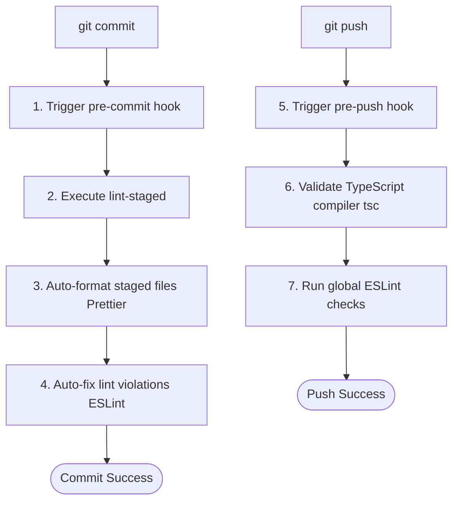

# Git Hooks & Code Quality Automation

This document outlines the Git hooks policy, configurations, lifecycle hooks, and local developer workflows implemented to safeguard the codebase from invalid commits and pushes.

---

## 1. Architectural Rationale

To maintain high standards of code quality and avoid breaking changes in production branches, we enforce automated local checks using **Husky** and **lint-staged**.

### Why Husky is Used

Git hooks are scripts that run automatically at key points in the Git lifecycle (e.g. before committing, before pushing). By default, these scripts live inside the local `.git/hooks` folder and are not committed to source control. Husky allows us to define and track these hooks directly in the repository under the `.husky/` directory, sharing configurations across all development environments.

### Why lint-staged is Used

Running static analysis (ESLint) and code formatting (Prettier) on the entire codebase during every single commit is slow and inefficient. `lint-staged` optimizes this process by targeting **only the files that are currently staged in Git**. This keeps commits fast while ensuring that all newly written code is secure and properly formatted.

---

## 2. Hook Lifecycles & Configurations



### Pre-Commit Hook (`.husky/pre-commit`)

Triggers automatically before files are committed.

- **Action**: Runs `npx lint-staged`.
- **Target Extensions**:
  - `*.{js,jsx,ts,tsx}`: Auto-formats with Prettier and resolves autofixable code quality violations via ESLint.
  - `*.{json,md,css,yaml,yml}`: Formats files to Prettier standards.
- **Fail behavior**: If any staged file contains violations that cannot be resolved automatically, the commit aborts.

### Pre-Push Hook (`.husky/pre-push`)

Triggers automatically before code is pushed to remote branches.

- **Action**: Runs `npm run type-check && npm run lint`.
- **Target Scope**: Codebase type compilation checks and global linter validations.
- **Fail behavior**: If there are type errors or lint warnings, the push aborts. This prevents broken code builds from reaching the remote repository.

---

## 3. Developer Workflow

1. **Standard Commit Workflow**:
   Stage your files and commit normally:

   ```bash
   git add apps/web/src/app/page.tsx
   git commit -m "feat(landing): optimize landing hero grid layout"
   ```

   Husky will format and verify your staged changes. If there are no issues, your commit will be created.

2. **Resolving Failures**:
   If the commit fails, read the terminal output logs to identify the files containing issues:
   - Fix compilation errors or lint violations.
   - Stage the changes (`git add`).
   - Run the commit command again.

---

## 4. Emergency Bypass (Bypass Hooks)

> [!CAUTION]
> Bypassing hooks should only be done in extreme emergencies (e.g. documentation-only updates or config patches when hotfixing). Never push compilation-failing code to remote repositories.

To bypass the pre-commit checks:

```bash
git commit -m "docs: hotfix typography typo" --no-verify
```

To bypass the pre-push checks:

```bash
git push origin feature-branch --no-verify
```
