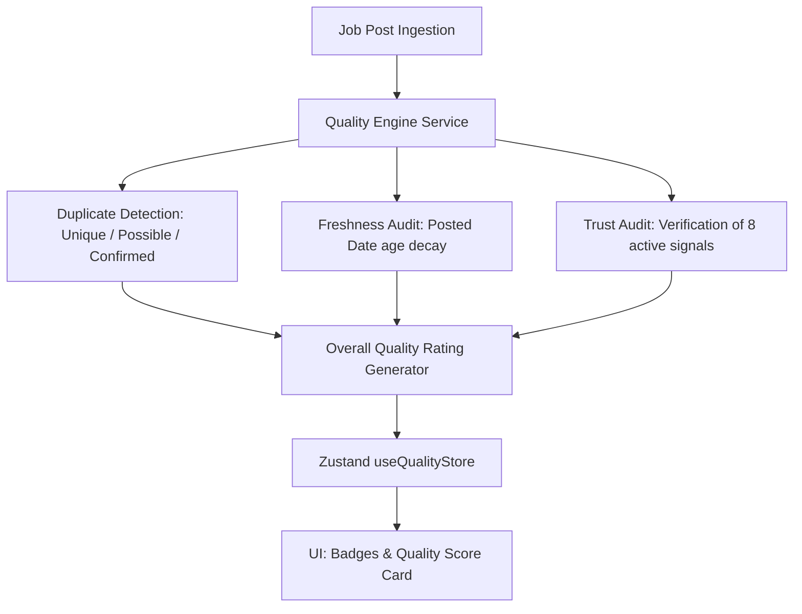

# Job Discovery: Quality Engine Architecture
 
## 1. Overview
The **Job Quality Engine** is an analytical module that audits and rates job postings before recommending them to candidates. It establishes quality, freshness, and trust thresholds, filtering duplicates and low-value listings.
 

 
---
 
## 2. Scoring Algorithms & Methodology
 
### A. Duplicate Detection Strategy
Evaluates overlap similarity across companies, titles, locations, types, salary details, and external posting IDs:
1. **Confirmed Duplicate (Score: 100)**: Exact matching `sourceJobId` OR matching company name + job title + location + type. Caps the overall score at **Poor**.
2. **Possible Duplicate (Score: 50)**: Matching company name + job title, but location or salary details differ. Applies a **20% penalty** to the overall rating.
3. **Unique (Score: 0)**: No similarities detected. Safe for recommendation.
 
### B. Freshness Calculation
Decays based on elapsed days since `postedDate` timestamp:
- **Today (< 24h)**: 95% Score
- **1-3 Days**: 80% Score
- **4-7 Days**: 60% Score
- **8-14 Days**: 40% Score
- **15-30 Days**: 20% Score
- **30+ Days**: 0% Score (Marked as **Expired**)
 
### C. Trust Calculation
Checks for 8 active authenticity signals (each met criteria counts for +12.5%):
- **Official Company Website**: direct link starting with http/https.
- **Verified Provider Source**: wellfound, ycombinator, or greenhouse.
- **Indexed Job Board**: not manually posted.
- **Salary Disclosed**: salary ranges present.
- **Company Logo**: logo Url present.
- **Detailed Specifications**: description > 150 characters.
- **Secure Apply Link**: routes to secure external portals.
- **Verified Recruiter**: easy-apply enabled or pre-verified flags.
 
*Labels mapped by criteria met:*
- **0–2 met**: Low Trust
- **3–4 met**: Medium Trust
- **5–6 met**: High Trust
- **7–8 met**: Verified Trust
 
### D. Overall Quality Score
Calculates weighted combination:
$$\text{Overall Score} = (\text{Freshness} \times 0.4) + (\text{Trust} \times 0.6)$$
 
*Adjustments:*
- Confirmed duplicates force overall rating to **Poor (15%)**.
- Possible duplicates apply a **20% penalty** multiplier.
 
*Ratings matrix:*
- **>= 85%**: Excellent
- **>= 70%**: Very Good
- **>= 50%**: Good
- **>= 30%**: Average
- **< 30%**: Poor
 
---
 
## 3. Zustand Integration & UI Caching
 
The `useQualityStore` provides client-side caching of computed audits, preventing redundant loops:
- `reports: Record<string, QualityReport>`: maps job ID to computed values.
- `calculateJobQuality(job, allJobs, force = false)`: resolves from cache unless force recalculation is active.
