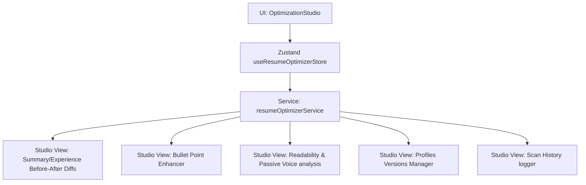

# AI Resume Optimization (Advanced) Architecture
 
## 1. Overview
The **Advanced Resume Optimization** module extends the core capabilities with interactive tools inside a dedicated **AI Optimization Studio**.
 

 
---
 
## 2. Before / After Comparison
The Comparison Engine computes the differences between original summaries/experience logs and optimized content:
- **Diff Highlights**: Provides red/green indicators for added terms.
- **Summary Optimizer**: Suggests metric-driven profiles and lists rationales for recommended revisions.
 
---
 
## 3. Experience Bullet Enhancer
Enhances raw, passive descriptions into professional, impact-driven statements:
- **Rule Engine**: Converts weak active verbs (e.g. *worked*, *fixed*) into strong ones (*engineered*, *resolved*) and appends mock metrics (e.g. *latency reduced by 25%*).
- **Business Impact**: Explains the rationale behind each enhancement (e.g. *linked technical stability to system uptime KPIs*).
 
---
 
## 4. Readability Diagnostics
Computes readability metrics:
- **Sentence Length**: Calculates average words per sentence.
- **Passive Voice**: Identifies occurrences of passive voice helper verbs (`was`, `were`, `been`).
- **Grammar Warnings**: Counts flagged grammar items.
- **Tone Classification**: Maps formatting to a target tone (e.g., *Professional & Metrics-focused*).
 
---
 
## 5. Versions and Exporting
*   **Version Variants**: Allows users to manage tailored profiles (Frontend, Backend, Full Stack, DevOps).
*   **Mock Export Handler**: Simulates downloading optimized layouts as PDF or DOCX format.
*   **History Logs**: Caches past optimization scans with timestamps, scores, and target roles in the Zustand store.
