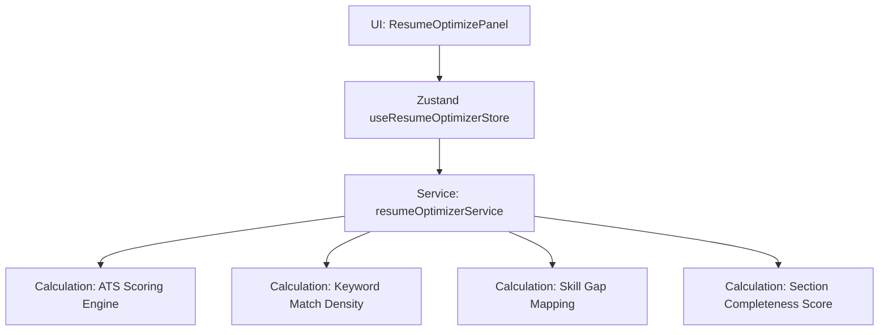

# AI Resume Optimization Architecture
 
## 1. Overview
The **AI Resume Optimization** module analyzes candidate resumes against job descriptions to compute ATS Scores, identify keyword and skill gaps, and provide categorized prioritization checklists.
 

 
---
 
## 2. ATS Scoring Engine
The mock ATS engine compiles scores between 0–100 based on weighted metrics:
 
$$\text{ATS Score} = 0.4 \times \text{Keyword Score} + 0.3 \times \text{Completeness} + 0.2 \times \text{Content Quality} + 0.1 \times \text{Readability}$$
 
*   **Completeness Score**: Inspects if required fields (name, email, phone, location, summary length, and experience description length) exist.
*   **Keyword Score**: Evaluates matching technical keywords found in both the job description and the resume content.
*   **Readability Score**: Checks formatting lengths and summary densities.
 
---
 
## 3. Section Analysis
Each section (Contact, Summary, Skills, Experience, Education, Projects, Certifications) is scored on completeness and maps to a status:
- `excellent` (>= 90%)
- `good` (>= 70%)
- `needs_improvement` (>= 40%)
- `poor` (< 40%)
 
---
 
## 4. Keyword & Skill Gap Logic
*   **Matched Keywords**: Occurs when a JD technical keyword is present inside the resume.
*   **Missing Keywords**: JD technical keywords absent from the resume texts.
*   **Density**: Tracks frequency percentages to prevent keyword stuffing.
*   **Skill Gaps**: Priority listing recommending missing keywords capitalized as professional skill names.
 
---
 
## 5. Store State Management
Managed in `useResumeOptimizerStore`:
- `analysis`: Holds computed `OptimizerAnalysis` reports.
- `loading`: Tracks calculation latencies.
- `jobDescription`: Input string pasted by user.
