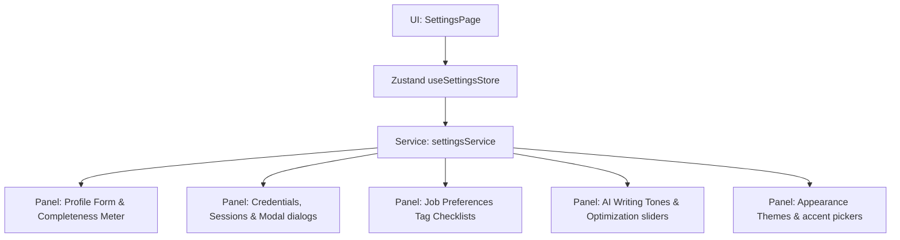

# Settings & Preferences Architecture
 
## 1. Overview
The **Settings & Preferences** module acts as the centralized console where users manage their profile details, job discovery preferences, AI defaults, notifications, and security attributes.
 

 
---
 
## 2. Profile Completion Logic
The completion progress meter calculates completeness based on the status of core fields:
- Full Name
- Professional Headline
- Professional Bio
- Location
- Phone Number
- Personal Website
- Portfolio link
- GitHub link
- LinkedIn link
- Twitter/X handle
 
Each non-empty field contributes equally to the total 100% completion target.
 
---
 
## 3. State Management Design
- **Draft Snapshot Clones**: When settings are loaded, they are cloned to a `draftSettings` state. Edits are staged on this draft copy.
- **Unsaved Changes Flag**: Computes deep inequality comparisons between current saved settings and the active draft.
- **Sticky Save Bar**: When changes exist, a sticky control panel is mounted letting users commit or discard changes.
 
---
 
## 4. Security & Compliance (GDPR/CCPA)
- **Active Devices List**: Displays active login sessions with IP location metadata and timeout parameters.
- **Data Portability Port**: Supports importing/exporting configurations in standard JSON format.
- **GDPR Cleansing**: Triggers mock functions allowing deletion of all telemetry records.
