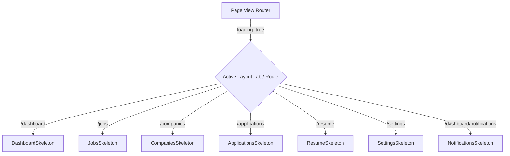

# Skeleton Loading System Architecture
 
This document details the high-fidelity Skeleton Loading System implemented across the AI Career Agent platform, replacing generic spinner icons with layout-specific layout blueprints.
 
---
 
## 1. System Architecture
 
The skeleton loading system follows a blueprint pattern. Instead of a single generic shape stretched across columns, every screen or module uses a dedicated skeleton loader component designed to match the exact spacing, visual layout, and dimensions of the populated UI.
 

 
---
 
## 2. Component Hierarchy
 
The skeletons are defined in [skeleton-loaders.tsx](file:///Users/anshul/Projects/Ai%20Agent/AI%20Career%20Agent/apps/web/src/components/ui/skeleton-loaders.tsx) and leverage the atomic `<Skeleton />` base primitive:
 
1.  **Dashboard Skeletons**:
    *   `StatsCardSkeleton`: Matches stats count and percentage trend layout.
    *   `ResumeProgressCardSkeleton` & `ProfileCompletionCardSkeleton`: Matches progress bar tracker heights and details buttons.
    *   `RecommendedJobCardSkeleton`: Matches logo container, badges row, and actions.
    *   `RecentApplicationTableSkeleton`: Matches table rows list structure.
    *   `ActivityTimelineSkeleton`: Matches timeline vertical logs and points.
    *   `RecentlyViewedJobsCardSkeleton`: Matches compact list layouts.
2.  **Jobs Discovery Skeletons**:
    *   `JobCardSkeleton`: Matches title, badges, description snippet, tags, and footer info.
    *   `JobsFilterSkeleton`: Matches search inputs, select fields, and sliders.
    *   `JobDetailsSkeleton`: Matches detailed job specification layout.
3.  **Companies Directory Skeletons**:
    *   `CompanyCardSkeleton`: Matches logo, count badge, description, and footer link.
    *   `CompanyDetailsSkeleton`: Matches banner layout, culture, openings list, and facts sidebar.
4.  **Applications Skeletons**:
    *   `ApplicationCardSkeleton`: Matches Kanban board cards.
    *   `ApplicationTimelineSkeleton`: Matches checklist logging dialog.
    *   `CalendarSkeleton`: Matches monthly grid layout blocks.
5.  **Resume Workspace Skeletons**:
    *   `ResumeCardSkeleton`: Matches workspace draft card tags, scores, and metadata.
    *   `ResumeBuilderSkeleton`: Matches double column editing workspace.
    *   `ResumePreviewSkeleton`: Matches A4 resume layout sheet preview.
6.  **Resume Optimizer Skeletons**:
    *   `ResumeOptimizerSkeleton`: Matches circular score meter and gaps feedback lists.
7.  **Cover Letters Skeletons**:
    *   `CoverLetterDashboardSkeleton`: Matches letter drafts grids.
    *   `CoverLetterEditorSkeleton`: Matches wizard text editing canvas.
    *   `CoverLetterPreviewSkeleton`: Matches serif document layout.
8.  **Settings & Alerts Skeletons**:
    *   `SettingsSkeleton`: Matches desktop sidebar navigation and configuration panels.
    *   `NotificationSkeleton` & `NotificationsSkeleton`: Matches category selections and line lists.
    *   `SavedJobSkeleton` & `JobAlertSkeleton`: Matches card toggles and parameters list filters.
9.  **Profile Skeletons**:
    *   `ProfileSkeleton`: Matches avatar profile header cards, CV feeds list columns, strength status cards, and settings tables columns.
 
---
 
## 3. Loading Flow
 
Skeletons are loaded client-side based on the state variable `loading` or `isLoading` tracked in their respective Zustand stores (`jobs.store.ts`, `bookmark.store.ts`, `alerts.store.ts`, `application.store.ts`, `resume.store.ts`, etc.):
 
1.  **Mount**: The page hooks initiate fetching lists from the services.
2.  **State Change**: Store updates `loading = true`.
3.  **Render**: Page intercepts `loading` and replaces the render canvas with the layout-specific skeleton loader.
4.  **Resolve**: Store updates `loading = false` with populated list values, mounting the final UI with zero layout shifts.
 
---
 
## 4. Responsive Behavior
 
All skeleton loaders use the same Tailwind/brutalist responsive CSS configuration as the final cards and pages:
*   **Grid layout wrappers**: Leverage `grid-cols-1 sm:grid-cols-2 md:grid-cols-3 lg:grid-cols-4` to adjust the number of loading placeholders depending on screen width.
*   **Flex-direction updates**: Shrink horizontal cards into vertical stacks on small viewports down to 320px automatically.
*   **Padding scalability**: Respect the dashboard spacing guidelines, preventing horizontal overflows or layout clipping.
